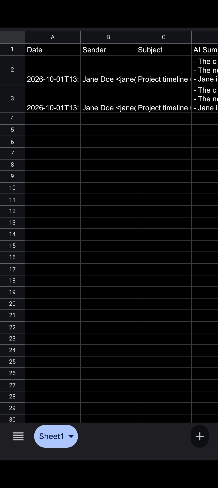
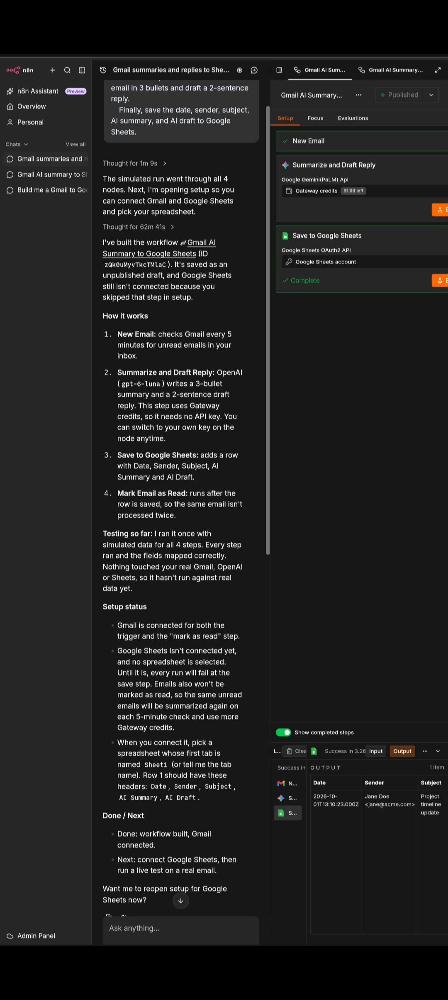

# AI Gmail Summarizer + Auto Draft Reply
100% Free AI Automation Workflow

## 🔗 Live Demo + Code
**GitHub Repo**: https://github.com/fauzia-annisa/ai-gmail-summarizer-n8n

## What it does
This workflow automatically checks Gmail every 5 minutes, uses AI to summarize incoming emails, drafts a reply, and saves everything to Google Sheets.

## Tech Stack - $0 Cost
- **n8n Cloud Free** - Workflow automation
- **Google Gemini API via n8n Gateway** - AI Summary + Draft
- **Gmail API** - Read new emails + Mark as read  
- **Google Sheets** - Save all data

## Demo Proof

## Setup Guide
1.  Download `gmail-ai-workflow.json` from this repo
2.  Import to n8n Cloud Free
3.  Connect Gmail and Google Sheets accounts
4.  Click Publish. Done.

## Cost
$0 / month. Uses n8n free tier + Gemini gateway credits.

Built for Upwork job: "AI Automation Specialist for a Small AI Workflow"
